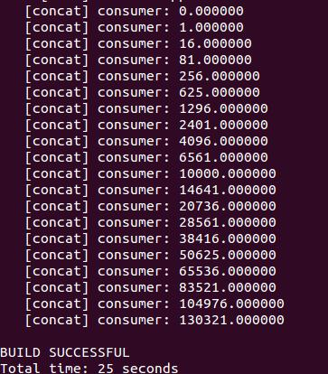
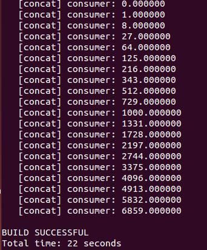

# DOL学习笔记一

`DOL笔记  DOL Git   Markdown`

###实验二：DOL实例分析&编程
学习任务：
- 修改example2，让3个square模块变成2个
- 修改example1，使其输出3次方数

**任务一：**
- 查看example2.xml文件发现，每一个iterator中都有一个variable和range，同时发现，文件中定义了一个variable，而example1中并没有，所以根据命名的含义和其它判断可知，修改variable的值是关键，因而尝试以下修改：
- 修改文件example2.xml中的：
```xml
  <variable value="3" name="N"/>
```
- 将其中的value值改为2:
```xml
  <variable value="2" name="N"/>
```
- 然后编译运行example2
```bash
$ cd build/bin/main
$ sudo ant -f runexample.xml -Dnumber=2 
```
- 运行结果：


- 发现结果是正确的。
- generator 生成0~19的整数，square经过两次平方操作，consumer输出结果

***

**任务二：**
- square是做平方操作的函数，要使其输出变为3次方数，需要修改square.c文件， 打开dol/examples/example1/src/square.c，可看到平方操作**i = i*i**,故尝试以下修改：
```c
将第15行中的
i = i*i
改为
i = i*i*i;
```
- 然后编译运行example1
```bash
$ cd build/bin/main
$ sudo ant -f runexample.xml -Dnumber=1 
```
- 运行结果：


- 同样，发现结果是正确的。
- generator 生成0~19的整数，square经过3次方操作，consumer输出结果


###实验心得与体会
- 实验开始前，对照着PPT将example1、2中的文件浏览了一下，对其整体的结构有了一个认识：在C代码中定义模块及模块进行的操作，在xml代码中定义模块间的连接；有三个进程：generator、consumer和square，generator进程产生整数输出到缓冲区1，square进程从缓冲区中读取数之后进行数的计算，计算后输出到缓冲区2，consumer进程从缓冲区中读取数后，将其打印在屏幕上。有了一些认识之后，此次的实验任务就变得比较简单了。


***

- 学号：14353024
- 邮箱：<431485077@qq.com>  


感谢阅读这份文档。


[1]:http://www.vmware.com/cn.html
[2]:https://www.ubuntu.com
[3]:http://rj.baidu.com/soft/detail/13808.html?ald
[4]:http://cn.ubuntu.com/download/